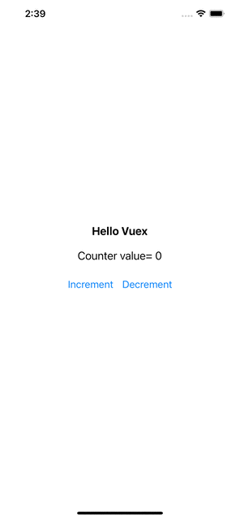

# Getting Started

At the center of every Vuex application is the **store**. A "store" is basically a container that holds your application **state**. There are two things that make a Vuex store different from a plain global object:

1. Vuex stores are reactive. When reactive components retrieve state from it, they will reactively and efficiently update if the store's state changes.

2. You cannot directly mutate the store's state. The _only_ way to change a store's state is by explicitly **committing mutations**. This ensures every state change leaves a track-able record, and enables us better understand our applications.

See the complete [API](../api/index.md), and how you can use Vuex with [Typescript](typescript-support.md) in your React applications.

## The Simplest Store

> NOTE We will be using ES2015 syntax for code examples for the rest of the docs. If you haven't picked it up, [you should](https://babeljs.io/docs/learn-es2015/)!

After [installing](../installation.md) Vuex, let's create a store. It is pretty straightforward - just provide an initial state object, and some mutations:

```ts
// ./state/counterStore.ts

import {Commit, createStore, Store} from "@visitsb/vuex";

export interface State {
    count: number
}

export const store: Store<State> = createStore({
    state: (): State => ({
        count: 0
    }),
    mutations: {
        INCREMENT(state: State) {
            state.count = state.count + 1
        },
        DECREMENT(state: State) {
            state.count = state.count - 1
        }
    },
    actions: {
        increment({commit}: { commit: Commit }) {
            commit('INCREMENT')
        },
        decrement({commit}: { commit: Commit }) {
            commit('DECREMENT')
        }
    }
});
```

In order to use the Vuex store with React components, we will use [Context](https://reactjs.org/docs/context.html) provider. 

```ts
// ./state/counterStore.ts

import {Context, createContext, useContext, useEffect, useState} from "react";

export const StoreContext: Context<Store<State>> = createContext(store);
export const StateContext: Context<State> = createContext(store.state);

export default function useCounterStore() {
    const store = useContext<Store<State>>(StoreContext);
    const state = useContext<State>(StateContext);

    let [watchedState, setWatchedState] = useState(state);

    useEffect((/*didUpdate*/) => {
        const unsubscribe = store.subscribe((_, newState) => setWatchedState((prevState) => ({...prevState, ...newState})));

        return (/*cleanup*/) => {
            unsubscribe();
        }
    }, []);

    // Ensure we can use mapXXX, createNamespacedHelpers
    const _globalThis = (globalThis || self || window || global || {});
    if (typeof _globalThis.$store === 'undefined') {
        _globalThis.$store = store;
    }

    return {store, state: watchedState};
}
```

> Note the Vuex `store.state` is reactive, but not understood by React. So a reactive state using React's [useState](https://reactjs.org/docs/hooks-state.html) is exposed in above setup.

Now, you can pass the `store`, `state` to individual components via React's [Context.Provider](https://reactjs.org/docs/context.html#contextprovider):

```tsx
// App.tsx

import {SafeAreaProvider} from 'react-native-safe-area-context';
import CounterExample from "./screens/CounterExample";
import useCounterStore, {StateContext, StoreContext} from "./state/counterStore";

export default function App() {
    const {store, state} = useCounterStore();

    return <SafeAreaProvider>
        <StoreContext.Provider value={store}>
            <StateContext.Provider value={state}>
                <CounterExample/>
            </StateContext.Provider>
        </StoreContext.Provider>
    </SafeAreaProvider>;
}
```

Inside your React component, you can access the store object as `const store = useContext(StoreContext)`, and trigger a state change with the `store.commit` method:

```ts
// screens/CounterExample.tsx

import {Button, StyleSheet} from 'react-native';
import {Text, View} from '../components/Themed';
import {useContext} from "react";
import {StateContext, StoreContext} from "../state/counterStore";

export default function CounterExample() {
    const store = useContext(StoreContext);

    function increment() {
        store.dispatch('increment');
    }

    function decrement() {
        store.dispatch('decrement');
    }

    return (
        <View style={styles.container}>
            <Text style={styles.title}>Hello Vuex</Text>
            <StateContext.Consumer>{((state) =>
                // Reactively updates below counter as state mutates
                <Text style={styles.text}>Counter value= {state.count}</Text>)
            }
            </StateContext.Consumer>
            <View style={styles.buttons}>
                <Button title="Increment" onPress={increment}/>
                <Button title="Decrement" onPress={decrement}/>
            </View>
        </View>
    );
}

const styles = StyleSheet.create({
    container: {
        flex: 1,
        alignItems: 'center',
        justifyContent: 'center',
    },
    title: {
        fontSize: 20,
        fontWeight: 'bold',
    },
    text: {
        fontSize: 20,
        paddingVertical: 20
    },
    buttons: {
        flexDirection: "row",
        justifyContent: "center"
    }
});
```

> Note the use of [Context.Consumer](https://reactjs.org/docs/context.html#contextconsumer) is simply to render _just_ the UI affected by state changes. Of course, you can use `const state = useContext(StateContext)` instead which will cause the whole component to re-render. Depending on how your component is designed, you can choose how your UI should update based on state changes.

Below is a preview of the Counter example using Vuex in React Native application.



In your components, you can access the store in the same fashion. Now we can commit a mutation using a component method:

```tsx
const store = useContext(StoreContext);
const state = useContext(StateContext);

function increment() {
    store.commit('INCREMENT');
    console.log(state.count);
}
```

Again, the reason we are committing a mutation instead of changing `state.count` directly, is because we want to explicitly track it. This simple convention makes your intention more explicit, so that you can reason about state changes in your app better when reading the code. In addition, this gives us the opportunity to implement tools that can log every mutation, take state snapshots, or even perform time travel debugging.

Using store state in a component simply involves returning the state within a computed property, because the store state is reactive. Triggering changes simply means committing mutations in component methods.

Next, we will discuss each core concept in much finer details, starting with [State](state.md).
