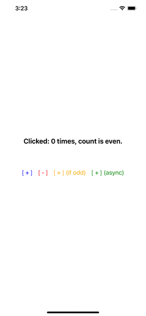
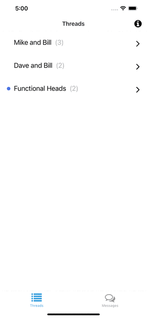
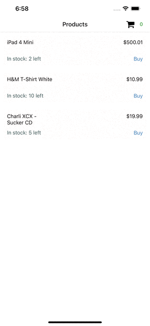

# Vuex (for use with React, ReactJs, React-Native)

See each example folder for complete source. 

> All examples are based on [React Native](https://reactnative.dev/) project built using [Expo](https://docs.expo.dev/)

## Counter

Simple working example demonstrating Vuex.

## Todo

MVC example using some additional features such as getters from Vuex.

## Chat

Slightly complex example using Vuex demonstrating async actions, mock API invocations.

## Shopping Cart

A real-world, complete & feature-rich example using all of the features, including modules in Vuex.

